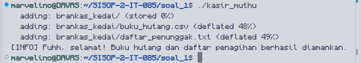
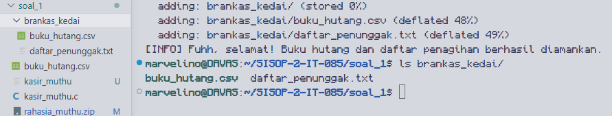
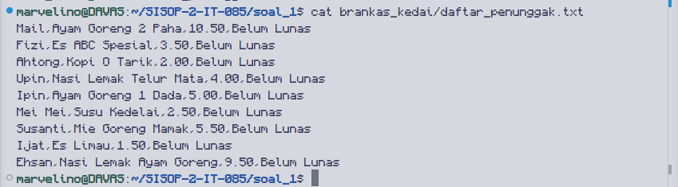
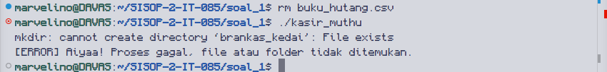
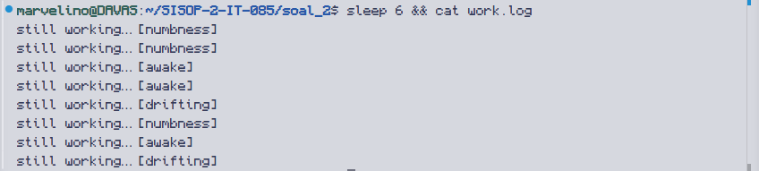
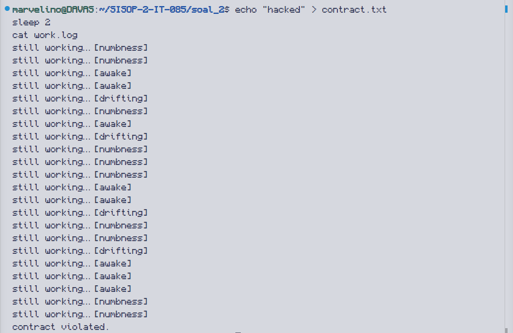
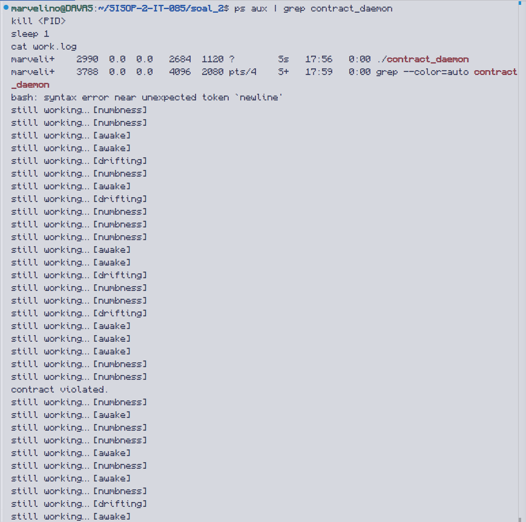
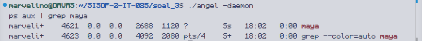
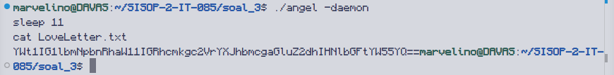
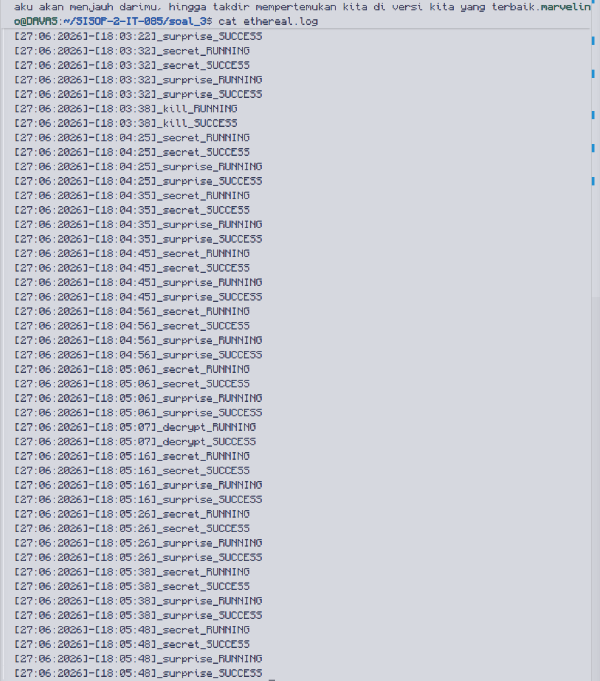

# SISOP-2-2026-IT-085

Pengerjaan Praktikum Sistem Operasi Modul 2

- [Soal 1 - Kasbon Warga Kampung Durian Runtuh](#soal-1---kasbon-warga-kampung-durian-runtuh)
- [Soal 2 - The world never stops, even when you feel tired](#soal-2---the-world-never-stops-even-when-you-feel-tired)
- [Soal 3 - One letter for destiny](#soal-3---one-letter-for-destiny)

---

| No | Nama | NRP |
| --- | --- | --- |
| 1 | Marvelino Davas | 5027241085 |

---

## Soal 1 - Kasbon Warga Kampung Durian Runtuh

### Penjelasan

Program `kasir_muthu.c` dibuat untuk membantu Uncle Muthu mengamankan data buku hutang yang terancam virus. Program menggunakan Sequential Process dengan kombinasi `fork()`, `execlp()`, dan `waitpid()` untuk menjalankan empat child process secara berurutan. Setiap child harus selesai sebelum child berikutnya dijalankan — parent (Upin) selalu memanggil `waitpid()` setelah setiap `fork()`.

**Child 1** — Membuat folder `brankas_kedai` menggunakan command `mkdir`:

```c
pid = fork();
if (pid == 0) {
    execlp("mkdir", "mkdir", "brankas_kedai", NULL);
    exit(1);
}
waitpid(pid, &status, 0);
```

**Child 2** — Menyalin `buku_hutang.csv` ke dalam `brankas_kedai` menggunakan command `cp`:

```c
pid = fork();
if (pid == 0) {
    execlp("cp", "cp", "buku_hutang.csv", "brankas_kedai/", NULL);
    exit(1);
}
waitpid(pid, &status, 0);
```

**Child 3** — Mencari semua data pelanggan berstatus `"Belum Lunas"` dan menyimpannya ke `daftar_penunggak.txt`. Menggunakan `bash -c` karena operator `>` adalah fitur shell, bukan fitur `grep` secara langsung:

```c
pid = fork();
if (pid == 0) {
    execlp("bash", "bash", "-c",
        "grep \"Belum Lunas\" brankas_kedai/buku_hutang.csv > brankas_kedai/daftar_penunggak.txt",
        NULL);
    exit(1);
}
waitpid(pid, &status, 0);
```

**Child 4** — Mengompres folder `brankas_kedai` menjadi `rahasia_muthu.zip` menggunakan command `zip -r`:

```c
pid = fork();
if (pid == 0) {
    execlp("zip", "zip", "-r", "rahasia_muthu.zip", "brankas_kedai/", NULL);
    exit(1);
}
waitpid(pid, &status, 0);
```

**Error Handling** — Setelah setiap `waitpid()`, program mengecek status keberhasilan child menggunakan `WIFEXITED` dan `WEXITSTATUS`. Jika gagal, program langsung berhenti:

```c
if (!(WIFEXITED(status) && WEXITSTATUS(status) == 0)) {
    printf("[ERROR] Aiyaa! Proses gagal, file atau folder tidak ditemukan.\n");
    exit(1);
}
```

### Output

1. Program berhasil dijalankan



2. Isi folder `brankas_kedai` setelah program berjalan



3. Isi `daftar_penunggak.txt`



4. Error handling saat file tidak ditemukan



### Kendala

Tidak ada kendala.

---

## Soal 2 - The world never stops, even when you feel tired

### Penjelasan

Program `contract_daemon.c` adalah daemon yang berjalan di background untuk memantau keberadaan dan integritas file `contract.txt`, serta menulis log ke `work.log` secara berkala.

**Inisialisasi Daemon** — Program mengikuti langkah standar pembuatan daemon dari template modul: `fork()` untuk memisahkan dari parent, `setsid()` untuk melepas diri dari terminal, `chdir()` untuk pindah ke direktori kerja, lalu menutup `stdin`, `stdout`, dan `stderr`:

```c
pid = fork();
if (pid < 0) exit(EXIT_FAILURE);
if (pid > 0) exit(EXIT_SUCCESS);

umask(0);
sid = setsid();
if (sid < 0) exit(EXIT_FAILURE);
if (chdir(cwd) < 0) exit(EXIT_FAILURE);

close(STDIN_FILENO);
close(STDOUT_FILENO);
close(STDERR_FILENO);
```

**Pembuatan contract.txt** — Saat pertama kali berjalan, daemon membuat file `contract.txt` berisi kalimat kontrak beserta timestamp `created at`:

```c
void create_contract(const char *label) {
    time_t now = time(NULL);
    struct tm *t = localtime(&now);
    char timestamp[32];
    strftime(timestamp, sizeof(timestamp), "%Y-%m-%d %H:%M:%S", t);

    FILE *f = fopen(CONTRACT_FILE, "w");
    if (f) {
        fprintf(f, "\"A promise to keep going, even when unseen.\"\n\n%s: %s\n", label, timestamp);
        fclose(f);
    }
}
```

**Logging berkala** — Setiap 5 detik daemon menulis ke `work.log` dengan salah satu dari tiga status acak menggunakan `rand() % 3`:

```c
if (counter % 5 == 0) {
    int idx = rand() % 3;
    char msg[64];
    snprintf(msg, sizeof(msg), "still working\xe2\x80\xa6 %s", statuses[idx]);
    write_log(msg);
}
```

**Restore jika dihapus** — Daemon mengecek keberadaan file setiap 1 detik menggunakan `fopen()`. Jika file tidak ditemukan, daemon langsung membuat ulang dengan label `restored at`:

```c
FILE *f = fopen(CONTRACT_FILE, "r");
if (!f) {
    create_contract("restored at");
}
```

**Deteksi perubahan isi** — Jika baris pertama `contract.txt` tidak sesuai kalimat aslinya, daemon mencatat `contract violated.` ke `work.log` lalu merestore file:

```c
char first_line[256];
fgets(first_line, sizeof(first_line), f);
fclose(f);

if (strncmp(first_line, "\"A promise to keep going, even when unseen.\"", 44) != 0) {
    write_log("contract violated.");
    create_contract("restored at");
}
```

**Pesan saat dihentikan** — Daemon menangkap sinyal `SIGTERM` menggunakan `signal()`. Saat sinyal diterima, loop berhenti dan daemon menulis pesan terakhir:

```c
void handle_sigterm(int sig) {
    running = 0;
}

signal(SIGTERM, handle_sigterm);

// setelah loop:
write_log("We really weren't meant to be together");
```

### Output

1. `contract.txt` saat pertama kali dibuat


2. `work.log` berjalan setiap 5 detik



3. `contract.txt` direstore setelah dihapus


4. `work.log` mencatat `contract violated.` setelah isi diubah



5. Pesan terakhir di `work.log` setelah daemon dihentikan



### Kendala

Tidak ada kendala.

---

## Soal 3 - One letter for destiny

### Penjelasan

Program `angel.c` adalah daemon yang berjalan di background dengan nama proses `maya`. Program menyediakan tiga mode operasi melalui argumen command line: `-daemon`, `-decrypt`, dan `-kill`.

**Inisialisasi Daemon** — Mengikuti template modul. Nama proses diubah menjadi `maya` menggunakan dua pendekatan sekaligus agar tampil benar di kolom CMD pada `ps aux`:

```c
prctl(PR_SET_NAME, "maya", 0, 0, 0);

char *m = argv[argc - 1] + strlen(argv[argc - 1]);
memset(argv[0], 0, m - argv[0]);
strcpy(argv[0], "maya");
```

PID daemon disimpan ke `/tmp/angel.pid` untuk keperluan fitur kill:

```c
FILE *pf = fopen(PID_FILE, "w");
if (pf) { fprintf(pf, "%d\n", getpid()); fclose(pf); }
```

**Fitur secret** — Berjalan otomatis setiap 10 detik, memilih satu kalimat acak dari empat pilihan lalu menulis ke `LoveLetter.txt`:

```c
void do_secret() {
    write_log("secret", "RUNNING");
    srand(time(NULL));
    int idx = rand() % 4;
    FILE *f = fopen(LOVE_LETTER, "w");
    if (!f) { write_log("secret", "ERROR"); return; }
    fprintf(f, "%s", sentences[idx]);
    fclose(f);
    write_log("secret", "SUCCESS");
}
```

**Fitur surprise** — Berjalan otomatis setelah secret selesai, mengenkripsi isi `LoveLetter.txt` menggunakan algoritma Base64 yang diimplementasikan manual:

```c
void do_surprise() {
    write_log("surprise", "RUNNING");
    // baca file → encode base64 → tulis kembali ke file
    base64_encode(content, fsize, encoded);
    write_log("surprise", "SUCCESS");
}
```

**Fitur decrypt** — Dipanggil eksplisit via `./angel -decrypt`, mendekripsi isi `LoveLetter.txt` kembali ke bentuk asli:

```c
void do_decrypt() {
    write_log("decrypt", "RUNNING");
    // baca file → decode base64 → tulis kembali ke file
    base64_decode(content, decoded);
    write_log("decrypt", "SUCCESS");
}
```

**Fitur kill** — Dipanggil via `./angel -kill`, membaca PID dari `/tmp/angel.pid` lalu mengirim `SIGTERM`:

```c
void do_kill() {
    write_log("kill", "RUNNING");
    FILE *pf = fopen(PID_FILE, "r");
    if (!pf) {
        write_log("kill", "ERROR");
        printf("Error: daemon belum berjalan.\n");
        return;
    }
    pid_t pid;
    fscanf(pf, "%d", &pid);
    fclose(pf);
    if (kill(pid, SIGTERM) == 0) {
        remove(PID_FILE);
        write_log("kill", "SUCCESS");
    }
}
```

**Logging** — Seluruh aktivitas dicatat ke `ethereal.log` dengan format `[dd:mm:yyyy]-[hh:mm:ss]_nama-proses_STATUS`:

```c
void write_log(const char *process, const char *status) {
    FILE *f = fopen(ETHEREAL_LOG, "a");
    if (!f) return;
    time_t now = time(NULL);
    struct tm *t = localtime(&now);
    fprintf(f, "[%02d:%02d:%04d]-[%02d:%02d:%02d]_%s_%s\n",
        t->tm_mday, t->tm_mon+1, t->tm_year+1900,
        t->tm_hour, t->tm_min, t->tm_sec,
        process, status);
    fclose(f);
}
```

### Output

1. Menjalankan `./angel` tanpa argumen menampilkan usage


2. Proses daemon berjalan dengan nama `maya`



3. Isi `LoveLetter.txt` setelah fitur secret menulis kalimat


4. Isi `LoveLetter.txt` setelah fitur surprise mengenkripsi



5. Hasil `./angel -decrypt` dan isi `LoveLetter.txt` setelah didekripsi


6. Isi `ethereal.log`



7. `./angel -kill` menghentikan daemon


### Kendala

Tidak ada kendala.